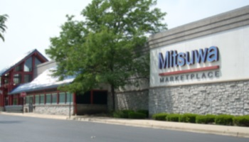

Events to be scheduled at the first few club meetings.
## Types of Events

### Mitsuwa Trip
<!---->
A trip to [Mitsuwa Marketplace](http://www.mitsuwa.com/), a Japanese market in Mount Prospect, IL. [Map <i class="glyphicon glyphicon-map-marker"></i>](https://goo.gl/maps/p3UIm) Make sure that you attend club meetings prior to the trip so we can discuss rides! Dues are required to pay for your gas money on this trip. Meet at the Holmes Student Center at 10:30 AM. If you are able to drive people to Mitsuwa, you will be compensated for gas.

### Club Parties
Activities at parties include, but are not limited to: Anime Jeopardy, Name that Tune, Anime Sharades, and of course videos games, card games, and board games.
#### Pizza Party
There is one pizza party each semester. Your dues will cover pizza for you. You may still attend if you have not paid dues, but will not be able to eat any pizza.

#### Potluck Party
There is one potluck party per semester. To eat food at the party, just bring some food you've __prepared__ yourself. Chips and drinks are provided.